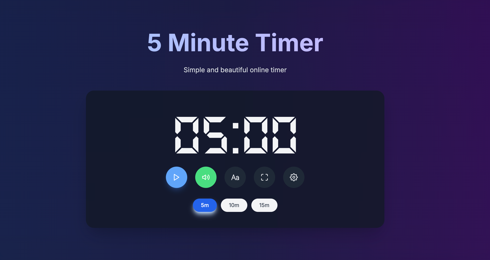

# MinuteTimer


Minute Timer is a lightweight and user-friendly timer application designed for anyone who values simplicity and efficiency in time management. Whether you're studying, working, exercising, or tackling daily tasks, Minute Timer helps you stay on track and maximize productivity.


## Key Features
-  Minimalist Interface: Focused on core functionality with no unnecessary distractions.
- Quick Setup: Set minute-based timers with just one click for effortless operation.
- Custom Alerts: Choose from sound, vibration, or desktop notifications to never miss a moment.
- Cross-Platform Support: Accessible on both desktop and mobile devices, anytime, anywhere.
- Open Source: Fully open-source, allowing for community contributions and customization.

### Who It's For
- Developers and creators seeking focus and productivity.
- Students using the Pomodoro technique.
- Anyone in need of efficient time management.
- How to Contribute
- We welcome contributions from the community! Share your ideas through Issues or submit Pull Requests to help us improve Minute Timer. Let's build something great together!

### License
This project is licensed under the MIT License, giving you the freedom to use, modify, and distribute the code.

Try Minute Timer today and make time management simple and effective! 🌟

## 🚀 Demo

Try it now: https://minutetimers.net

Deploy your own:

[](https://vercel.com/new/clone?repository-url=https%3A%2F%2Fgithub.com%2FHahaHa0099%2FMinuteTimer.git)

Example:
- https://minute-timer-chi.vercel.app/


### Screenshots

#### Desktop View


#### Mobile View


#### Dark Mode


## ⚡ Tech Stack

- **Framework**: Next.js 14, React 18
- **Styling**: Tailwind CSS, Framer Motion
- **State Management**: Zustand
- **Internationalization**: i18next
- **UI Components**: Radix UI
- **Deployment**: Vercel

### Environment Variables

To run this project, you will need to add the following environment variables to your .env file:

```bash
NEXT_PUBLIC_SITE_URL=https://your-domain.com
```

When deploying on Vercel, make sure to add these environment variables in your project settings.

## 🎯 Core Features

- 💡 Clean and intuitive interface
- 🌓 Automatic dark mode
- 🔔 Sound alerts
- ⌨️ Keyboard shortcuts
- 🌍 Multi-language support (English, Japanese, Korean, German, etc.)
- 📱 Responsive design for all devices
- 🖥️ Fullscreen mode
- ✨ Elegant animations
